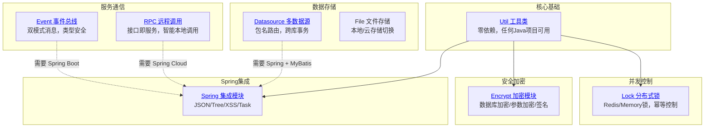

# MolanDev Framework

MolanDev Framework 是一个轻量级的 Java 开发框架工具集，核心亮点是**一套代码，单体与微服务自由切换**，提供开箱即用的企业级开发组件。

## 🎯 核心价值

### 解决架构演进痛点

**传统方案的两难困境：**
- 项目初期：微服务过度设计 → 开发效率低、调试困难
- 项目后期：单体重构微服务 → 推倒重来、风险巨大

**MolanDev 双模驱动方案：**
- 项目初期：单体模式极速开发，本地调试简单
- 业务扩展：一行配置切换微服务，业务代码零改动
- 持续演进：按需拆分服务，无需推翻重写

## 🏗️ 模块架构



## 📦 模块清单

| 模块 | 说明 | 依赖 | 项目使用频率 |
|------|------|------|-------------|
| [molandev-util](/modules/util/overview) | 通用工具类库，零依赖 | 无 | ⭐⭐⭐⭐⭐ 基础设施 |
| [molandev-encrypt](/modules/encrypt/overview) | 全链路加密方案 | Spring Boot, MyBatis | ⭐⭐⭐ 登录参数加密 |
| [molandev-lock](/modules/lock/overview) | Redis/Memory 分布式锁 | Spring Boot, Redis | ⭐⭐⭐⭐ 任务调度/文档摄入 |
| [molandev-datasource](/modules/datasource/overview) | 动态数据源，包名路由 | Spring, MyBatis | ⭐⭐⭐⭐⭐ 4个数据源隔离 |
| [molandev-rpc](/modules/rpc) | Feign 增强，智能本地调用 | Spring Cloud OpenFeign | ⭐⭐⭐⭐⭐ 8个FeignClient |
| [molandev-event](/modules/event) | 统一事件总线，双模式切换 | Spring Boot, RabbitMQ(可选) | ⭐⭐⭐⭐⭐ 任务/字典/消息通知 |
| [molandev-spring](/modules/spring/overview) | Spring 生态增强工具 | Spring Boot | ⭐⭐⭐⭐⭐ JSON/Tree/XSS |
| molandev-file | 本地/云文件存储 | Spring Boot, AWS SDK | ⭐⭐⭐⭐ 文件上传下载 |

## 🔄 双模式架构

这是 MolanDev Framework 最核心的设计哲学：**一套代码，通过配置在单体与微服务间自由切换**。

| 特性 | 单体模式 (`run-mode: single`) | 微服务模式 (`run-mode: cloud`) |
|------|-------------------------------|--------------------------------|
| **RPC 调用** | 自动走本地实现，无网络开销 | 跨服务走 Feign HTTP |
| **事件通知** | Spring Event 内存分发 | RabbitMQ 跨服务通信 |
| **数据源** | 多数据源共存一个进程 | 每个服务单数据源 |
| **分布式锁** | Memory 锁（开发环境） | Redis 锁（生产环境） |
| **部署复杂度** | 单进程，本地调试简单 | 多进程，需要 Nacos/RabbitMQ |

**切换方式：** 只需修改配置文件中的 `molandev.run-mode`，业务代码无需任何改动。

### 实际项目中的双模式配置

```yaml
# 单体模式配置（molandev-standalone-service）
molandev:
  run-mode: single
  lock:
    type: memory                    # 单机用内存锁
  service-name:
    molandev-base: ${spring.application.name}    # 服务名指向自己
    molandev-knowledge: ${spring.application.name}
```

```yaml
# 微服务模式配置（各独立服务）
molandev:
  run-mode: cloud
  lock:
    type: redis                     # 分布式用Redis锁
  service-name:
    molandev-base: molandev-base   # 服务名独立
    molandev-knowledge: molandev-knowledge

spring:
  rabbitmq:                         # 事件总线需要RabbitMQ
    host: localhost
    port: 5672
```

## 📊 模块依赖关系

```
molandev-util (零依赖)
    ├── molandev-encrypt (依赖 util + Spring + MyBatis)
    ├── molandev-lock (依赖 util + Spring + Redis可选)
    ├── molandev-spring (依赖 util + Spring Boot)
    └── molandev-file (依赖 util + Spring Boot + AWS SDK)

molandev-datasource (依赖 Spring + MyBatis)

molandev-rpc (依赖 util + Spring Cloud OpenFeign)
molandev-event (依赖 util + Spring Boot, RabbitMQ可选)
```

## 🚀 快速开始

### 环境要求

- JDK 8+ （推荐 JDK 21，支持虚拟线程）
- Maven 3.x

### 引入依赖

根据实际需求选择模块，无需全部引入：

```xml
<!-- 工具类 - 任何项目都可以用 -->
<dependency>
    <groupId>com.molandev</groupId>
    <artifactId>molandev-util</artifactId>
    <version>${molandev.version}</version>
</dependency>

<!-- Spring Boot 项目推荐组合 -->
<dependency>
    <groupId>com.molandev</groupId>
    <artifactId>molandev-spring</artifactId>
    <version>${molandev.version}</version>
</dependency>
<dependency>
    <groupId>com.molandev</groupId>
    <artifactId>molandev-event</artifactId>
    <version>${molandev.version}</version>
</dependency>
<dependency>
    <groupId>com.molandev</groupId>
    <artifactId>molandev-lock</artifactId>
    <version>${molandev.version}</version>
</dependency>
```

### 最小化示例

```java
// 工具类 - 零依赖，任何项目直接用
import com.molandev.framework.util.StringUtils;
import com.molandev.framework.util.IdUtils;

String uuid = IdUtils.uuid();
boolean empty = StringUtils.isEmpty(str);

// JSON 工具 - Spring 项目直接用
import com.molandev.framework.spring.json.JSONUtils;

String json = JSONUtils.toJsonString(user);
User user = JSONUtils.toObject(json, User.class);

// 分布式锁 - 任何需要并发控制的场景
import com.molandev.framework.lock.utils.LockUtils;

LockUtils.runInLock("ORDER_" + orderId, () -> {
    // 处理订单逻辑
});
```

## 🔗 与 molandev-backend 的关系

**MolanDev Framework** 是底层工具库，**molandev-backend** 是基于框架构建的企业级管理系统。

```
molandev-framework (工具库)
        ↓ 提供组件
molandev-backend (业务应用)
        ├── molandev-base      ← 用 Datasource/RPC/Event/Lock/Encrypt
        ├── molandev-knowledge ← 用 Datasource/Event/Lock
        └── molandev-standalone-service ← 统一启动入口
```

框架模块在业务应用中的具体使用场景，请查看 [云端管理文档](/cloud/guide/introduction)。

## 📚 下一步

选择一个模块深入了解：

- [Util 工具类](/modules/util/overview) - 通用工具类库，零依赖
- [Event 事件总线](/modules/event) - 双模式消息通知，类型安全
- [Lock 分布式锁](/modules/lock/overview) - Redis/Memory 锁，幂等控制
- [RPC 远程调用](/modules/rpc) - 接口即服务，智能本地调用
- [Encrypt 加密模块](/modules/encrypt/overview) - 全链路数据加密
- [Datasource 多数据源](/modules/datasource/overview) - 包名路由，跨库事务
- [Spring 集成模块](/modules/spring/overview) - JSON/Tree/XSS 工具
