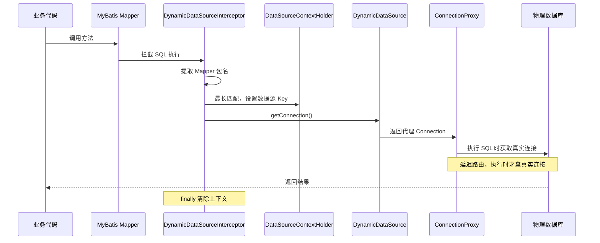

# 多数据源模块概览

`molandev-datasource` 是一个专为单体与微服务混合部署场景设计的动态数据源解决方案。基于**连接代理模式**和 MyBatis 拦截器实现，支持根据 Mapper 的包名自动切换物理数据库，并支持在同一事务内访问多个数据源。

## 核心特性

- ✅ **包名路由**：根据 Mapper 接口所在包名自动切换数据源，无需任何注解
- ✅ **最长匹配优先**：支持包名嵌套，自动选择最具体的配置
- ✅ **跨库事务**：连接代理模式实现同一事务内访问多数据源
- ✅ **通用连接池**：支持 HikariCP、Druid、DBCP2 等任意连接池
- ✅ **零侵入**：业务代码无需任何修改，配置驱动

## 工作原理



## 快速开始

### 1. 引入依赖

```xml
<dependency>
    <groupId>com.molandev</groupId>
    <artifactId>molandev-datasource</artifactId>
    <version>${molandev.version}</version>
</dependency>
```

### 2. 配置多数据源

```yaml
molandev:
  datasource:
    sys:                              # 数据源名称
      url: jdbc:postgresql://localhost:5432/molandev_base
      username: postgres
      password: postgres
      driver-class-name: org.postgresql.Driver
      primary: true                   # 标记为主数据源
      packages:
        - com.molandev.base           # 该包下的 Mapper 使用此数据源

    knowledge:                        # 第二个数据源
      url: jdbc:postgresql://localhost:5432/molandev_kl
      username: postgres
      password: postgres
      driver-class-name: org.postgresql.Driver
      packages:
        - com.molandev.knowledge      # 该包下的 Mapper 使用此数据源
```

### 3. 按包名组织 Mapper

```
com.molandev.base
├── mapper
│   ├── SysUserMapper.java          ← 使用 sys 数据源
│   └── SysRoleMapper.java          ← 使用 sys 数据源

com.molandev.knowledge
├── mapper
│   ├── KlDocumentMapper.java       ← 使用 knowledge 数据源
│   └── KlChunkMapper.java          ← 使用 knowledge 数据源
```

**无需在 Mapper 上添加任何注解**，框架根据包名自动路由。

## 项目中的实际应用

### 4 个数据源隔离

**配置位置：** `molandev-standalone-service/src/main/resources/application-pg.yml`

项目中配置了 4 个独立数据源，实现数据隔离：

```yaml
molandev:
  datasource:
    sys:                                    # 系统数据库
      url: jdbc:postgresql://localhost:5432/molandev_base
      username: postgres
      password: postgres
      driver-class-name: org.postgresql.Driver
      primary: true
      packages:
        - com.molandev.base

    knowledge:                              # 知识库数据库
      url: jdbc:postgresql://localhost:5432/molandev_kl
      username: postgres
      password: postgres
      driver-class-name: org.postgresql.Driver
      packages:
        - com.molandev.knowledge

    xiuxian:                                # 修仙游戏数据库
      url: jdbc:postgresql://localhost:5432/molandev_xiuxian
      username: postgres
      password: postgres
      driver-class-name: org.postgresql.Driver
      packages:
        - com.molandev.xiuxian

    vector:                                 # 向量数据库 (PgVector)
      url: jdbc:postgresql://localhost:5432/molandev_vector
      username: postgres
      password: postgres
      driver-class-name: org.postgresql.Driver
```

**数据隔离说明：**

| 数据源 | 数据库 | 用途 | Mapper 包路径 |
|--------|--------|------|--------------|
| `sys` | `molandev_base` | 用户、角色、菜单、字典、文件等系统管理 | `com.molandev.base.*` |
| `knowledge` | `molandev_kl` | 知识库文档、分片、检索 | `com.molandev.knowledge.*` |
| `xiuxian` | `molandev_xiuxian` | 修仙游戏业务数据 | `com.molandev.xiuxian.*` |
| `vector` | `molandev_vector` | 向量存储（AI 知识库检索） | 无 Mapper，PgVector 专用 |

> 📖 **详细说明** → [快速开始文档](/cloud/guide/quick-start) 数据库配置章节

### 跨数据源获取连接

**代码位置：** `molandev-knowledge/.../config/PgVectorStoreAutoConfiguration.java`

当需要在代码中显式获取特定数据源时，可通过 `DynamicDataSource` 的反射方法获取：

```java
public JdbcTemplate jdbcTemplate(DataSource dataSource) {
    if (dataSource.getClass().getName().equals("com.molandev.framework.datasource.DynamicDataSource")) {
        // 通过反射调用 getTargetDataSource 获取指定数据源
        Method method = dataSource.getClass().getMethod("getTargetDataSource", String.class);
        DataSource vectorDataSource = (DataSource) method.invoke(dataSource, "vector");

        if (vectorDataSource == null) {
            throw new IllegalStateException("无法从动态数据源中获取名为 'vector' 的数据源");
        }
        return new JdbcTemplate(vectorDataSource);
    }
    return new JdbcTemplate(dataSource);
}
```

> 📖 **详细说明** → [知识库文档](/cloud/knowledge)

## 事务管理

### 单库事务

Spring 的 `@Transactional` 注解**完全支持**，行为与传统单数据源一致：

```java
@Transactional
public void updateUser(String userId, String name) {
    // 操作 sys 数据源
    userMapper.updateName(userId, name);
    // 异常时自动回滚
}
```

### 跨库事务

在同一事务内访问多个数据源时，框架通过连接代理模式实现统一提交/回滚：

```java
@Transactional
public void crossDataSourceOperation() {
    // 操作 sys 库
    userMapper.updateUserBalance(userId, amount);

    // 操作 knowledge 库
    orderMapper.createOrder(order);

    // 异常时两个数据源都会回滚
}
```

**工作原理：**
- 为每个访问的数据源维护一个独立的连接
- `commit()`/`rollback()` 会应用到所有数据源

**⚠️ 限制：**
这不是真正的分布式事务：
1. **提交非原子性**：如果第一个数据源提交成功但第二个失败，第一个无法回滚
2. **不适合强一致性场景**：金融交易等关键业务建议使用 Seata 或 XA 事务
3. **适用场景**：微服务合并、读写分离、容忍最终一致性的业务

## 最佳实践

### 包名设计

```
com.molandev.base          ← 系统管理数据源（默认）
├── mapper.sys             ← sys 库
├── mapper.dict            ← sys 库

com.molandev.knowledge     ← 知识库数据源
├── mapper.document        ← knowledge 库
├── mapper.search          ← knowledge 库
```

**建议：**
- 按业务模块划分包结构
- 同一数据源的 Mapper 放在同一包下
- 避免跨数据源频繁访问

### 锁粒度

- 合理设计 Mapper 的包结构，避免频繁的数据源切换
- 跨库事务会为每个数据源维护一个连接，避免在事务中访问过多数据源

## 总结

molandev-datasource 提供了：

- ✅ 包名路由自动切换，零侵入
- ✅ 最长匹配优先，支持嵌套包
- ✅ 跨库事务支持（非原子性提交）
- ✅ 通用连接池，支持任意连接池
- ✅ 项目实战：4 个数据源隔离（sys/knowledge/xiuxian/vector）
