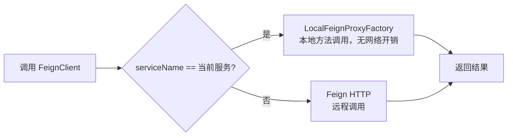

# RPC 远程调用

`molandev-rpc` 是对 Spring Cloud OpenFeign 的深度封装与增强。旨在简化微服务开发，支持通过接口定义自动创建 MVC 映射，并提供智能的"单体/微服务"无缝切换能力。

## 核心特性

- ✅ **接口即服务**：只需定义 Feign 接口并实现，无需编写 Controller
- ✅ **智能本地调用**：同服务内调用自动走本地实现，无网络开销
- ✅ **零配置切换**：引入依赖即生效，自动判断调用方式
- ✅ **自动降级支持**：完美集成 Feign Fallback 机制
- ✅ **透明化调用**：调用方感知不到底层是本地 Bean 还是远程 HTTP

## 工作原理



**自动映射机制：**
1. 启动时扫描归属于当前服务的 FeignClient（`@FeignClient(name)` 与 `spring.application.name` 匹配）
2. 自动将接口注册为 Spring MVC 的 HandlerMapping
3. 调用时自动路由到本地实现或远程 HTTP

## 快速开始

### 1. 引入依赖

```xml
<dependency>
    <groupId>com.molandev</groupId>
    <artifactId>molandev-rpc</artifactId>
    <version>${molandev.version}</version>
</dependency>
```

> **注意**：该模块依赖于 `Spring Cloud OpenFeign`，请确保项目中已配置。

### 2. 定义与实现接口

```java
// 1. 定义 Feign 接口
@FeignClient(name = "${molandev.service-name.molandev-base:molandev-base}",
             contextId = "sysUserApi", path = "/feign/user")
public interface SysUserApi {
    @GetMapping("/admin")
    UserDto getAdmin(@RequestParam("id") String id);
}

// 2. 实现接口（无需编写 Controller）
@Service
public class SysUserApiImpl implements SysUserApi {
    @Override
    public UserDto getAdmin(String id) {
        return userService.getAdminUser(id);
    }
}
```

### 3. 开启 Feign 扫描

```java
@SpringBootApplication
@EnableFeignClients(basePackages = "com.molandev.api")
public class YourApplication {
    public static void main(String[] args) {
        SpringApplication.run(YourApplication.class, args);
    }
}
```

**无需任何额外配置**，框架会自动：
- 同服务内调用 → 自动走本地实现
- 跨服务调用 → 自动走 Feign HTTP

## 服务名动态映射

为支持单体/微服务切换，项目中使用 `${molandev.service-name.xxx:default}` 动态配置服务名：

```yaml
# 单体模式：所有服务名都指向当前应用
molandev:
  service-name:
    molandev-base: ${spring.application.name}
    molandev-knowledge: ${spring.application.name}

# 微服务模式：服务名独立
molandev:
  service-name:
    molandev-base: molandev-base
    molandev-knowledge: molandev-knowledge
```

## 项目中的实际应用

项目中定义了 8 个 FeignClient 接口，覆盖用户、字典、文件、任务、消息、知识库等服务：

### 系统用户服务

**代码位置：** `molandev-apis/.../sys/user/SysUserApi.java`

```java
@FeignClient(name = "${molandev.service-name.molandev-base:molandev-base}",
             contextId = "sysUserApi", path = "/feign/user")
public interface SysUserApi {
    @GetMapping("/admin")
    UserDto getAdmin(@RequestParam("id") String id);
}
```

> 📖 **详细说明** → [用户管理文档](/cloud/backend/user)

### 文件服务（支持文件上传）

**代码位置：** `molandev-apis/.../file/FileApi.java`

```java
@FeignClient(
    name = "${molandev.service-name.molandev-base:molandev-base}",
    contextId = "fileClient", path = "/feign/file/"
)
public interface FileApi {
    @PostMapping("permanentFiles")
    void permanentFiles(@RequestParam("paths") List<String> paths);

    @PostMapping(value = "upload", consumes = MediaType.MULTIPART_FORM_DATA_VALUE)
    String upload(@RequestPart("file") MultipartFile file,
                  @RequestParam(value = "biz", defaultValue = "default") String biz,
                  @RequestParam(value = "permanent", defaultValue = "false") Boolean permanent);
}
```

> 📖 **详细说明** → [文件管理文档](/cloud/backend/file)

### 知识库检索服务

**代码位置：** `molandev-apis/.../knowledge/KnowledgeRetrieveApi.java`

```java
@FeignClient(name = "${molandev.service-name.molandev-knowledge:molandev-knowledge}",
             contextId = "knowledgeRetrieveApi", path = "/feign/knowledge/retrieve")
public interface KnowledgeRetrieveApi {
    @PostMapping("/search")
    RetrievalResult search(@RequestBody KnowledgeSearchRequest request);
}
```

> 📖 **详细说明** → [知识库文档](/cloud/knowledge)

### 其他 FeignClient 接口

| 接口 | 服务 | 路径 | 用途 |
|------|------|------|------|
| `SysPropApi` | molandev-base | `/feign/prop/` | 系统属性查询 |
| `SysOpLogApi` | molandev-base | `/feign/oplog/` | 操作日志记录 |
| `SysDictApi` | molandev-base | `/feign/dict/` | 字典查询 |
| `MsgSendApi` | molandev-base | `/feign/msg/` | 消息发送 |
| `TaskExecutionResultApi` | molandev-base | `/feign/task/` | 任务执行回调 |

## 核心特性详解

### 自动 MVC 映射

框架启动时会自动识别归属于当前服务的 Feign 接口，并注册到 Spring MVC：

- 从 `@FeignClient` 的 `path` 属性获取基础路径
- 合并接口方法上的 `@GetMapping`/`@PostMapping` 等注解
- 将接口的本地实现类注册为 Handler

**这意味着不再需要编写 Controller 层**，直接通过 HTTP 请求访问接口定义的路径即可。

### 智能本地调用

框架通过 `LocalFeignProxyFactory` 实现智能调用路由：

| 场景 | 调用方式 | 性能 |
|------|---------|------|
| 同服务内（serviceName 匹配） | 本地方法调用 | ⚡ 无网络开销 |
| 跨服务（serviceName 不匹配） | Feign HTTP 远程调用 | 🔄 网络延迟 |

**设计优势：**
- 单体应用中，所有服务间调用自动变为本地方法调用
- 微服务架构中，同服务内的自调用自动优化，跨服务调用保持远程
- 调用方完全感知不到底层是本地还是远程

### 服务自动降级

框架完全支持 Feign 的 `fallback` 和 `fallbackFactory`：

```java
@Component
public class UserApiFallback implements SysUserApi {
    @Override
    public UserDto getAdmin(String id) {
        // 降级逻辑
        return new UserDto(id, "fallback");
    }
}
```

> **注意**：Fallback 类会被框架自动过滤，不会重复注册 MVC 映射。

## 常见问题

### FeignClient 没有被注册为本地调用？

**检查清单：**
- [ ] `@FeignClient(name)` 是否与 `spring.application.name` 匹配
- [ ] 是否开启了 `@EnableFeignClients` 扫描
- [ ] 接口实现类是否标注 `@Service` 或 `@Component`
- [ ] 实现类是否实现了 FeignClient 接口

### Fallback 没有生效？

**检查清单：**
- [ ] Fallback 类是否标注 `@Component`
- [ ] Fallback 类是否实现了同一个 FeignClient 接口
- [ ] 服务是否真的发生了调用失败（网络异常、超时等）

### 文件上传失败？

确保 FeignClient 接口定义了正确的 `consumes`：

```java
@PostMapping(value = "/upload", consumes = MediaType.MULTIPART_FORM_DATA_VALUE)
String upload(@RequestPart("file") MultipartFile file);
```

如需在非 HTTP 场景下构造 `MultipartFile`，可使用 `MultipartFileBuilder` 工具类（位于 `molandev-spring` 模块）。

## 总结

molandev-rpc 提供了：

- ✅ 接口即服务，无需编写 Controller
- ✅ 智能本地调用优化，同服务无网络开销
- ✅ 服务名动态映射，支持单体/微服务切换
- ✅ 自动降级支持，保证服务高可用
- ✅ 项目实战：8 个 FeignClient 覆盖核心服务
